# Create an iOS native application

In this demo you will create an iOS application and wire up the different screens.

Alternatively, you can open the final solution from this demo located in this folder. Refer to the prerequisites for what you need to run the demo.

## Prerequisites

To complete this lab, you need the following:

* Desktop / laptop running MacOS
* [XCode v9](https://developer.apple.com/xcode/)

## Demo steps

1. Open XCode.
1. Select **File > New > Project**.
    1. In the **Choose a template for your new project**, select **Page-Based App**.

        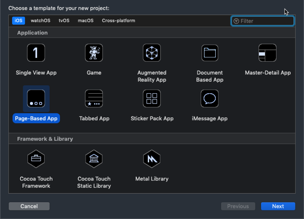

    1. Select **Next**.
    1. In the **Choose options for your new project**, enter the following values:
        * **Product Name**: NativeO365CalendarEvents
        * **Organization Name**: Microsoft
        * **Organization Identifier**: com.microsoft.officedev
        * **Language**: Objective-C
        * Unselect additional options

        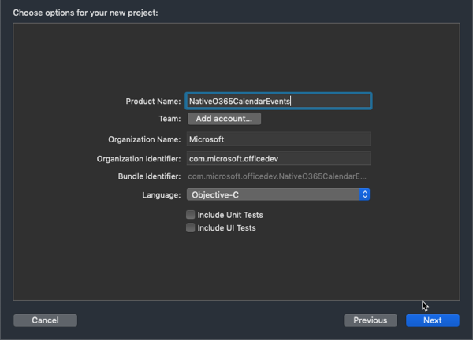

    1. Select **Next**.
    1. When prompted, select a location where to create the project on your workstation.
1. Cleanup the default storyboard
    1. In the **Navigator** panel, select the following files and delete them:
        * RootViewController.h
        * RootViewController.m
        * DataViewController.h
        * DataViewController.m
        * ModelController.h
        * ModelController.m
    1. In the **Project Manager** panel, select **Main.storyboard**:

        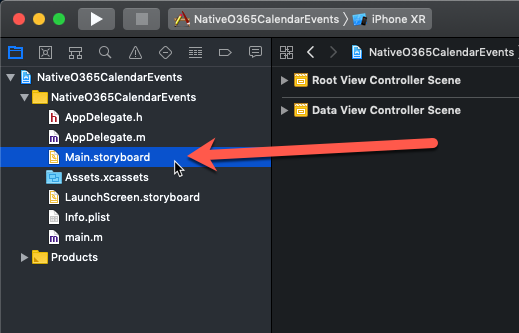

    1. Select all the items in the storyboard by selecting any of the elements in the design surface and press <kbd>delete</kbd>.
1. Create the application's UI in the storyboard:
    1. In the **Navigator** panel, select **Main.storyboard**.
    1. In the **Utilities** panel, select the **Library** button in the toolbar (*#1 in the figure below*) to open the **Object Library**.
    1. Select and drag the **Navigation Controller** onto the storyboard design surface:

        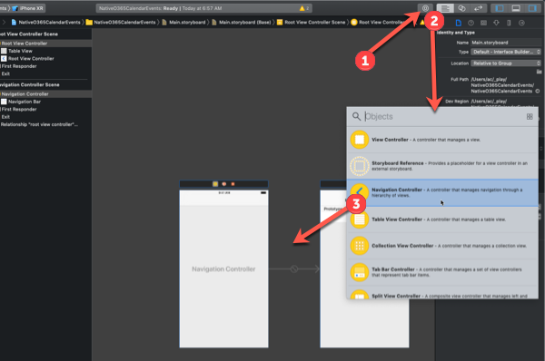

    1. Set the Navigation Controller as the initial view for the application:
        1. In the storyboard designer, select the **Navigation Controller**.
        1. In the **Utilities** panel, select the **Attributes Inspector**.
        1. Select the **Is Initial View Controller** option. Notice a faded right arrow is added to the storyboard, pointing to the Navigation Controller:

            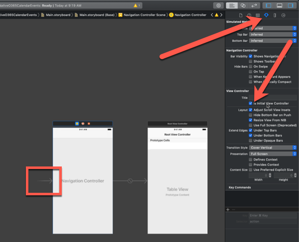

1. Create the a view controller that will be used by a new view you will create:
    1. Create a login view controller:
        1. Select **File > New File**.
        1. Select **Cocoa Touch Class** & select **Next**.
        1. In the **Choose options for your new file** dialog, set the following values, creating the file in the project root folder (the same folder where **AppDelegate.h** is located):
            * **Class**: LoginViewController
            * **Subclass of**: UIViewController
            * **Also create XIB file**: unselected
            * **Language**: Objective-C
        1. Open the **LoginViewController.h** file and add the following properties to the interface `LoginViewController`:

            ```objc
            @property (weak, nonatomic) IBOutlet UIButton *loginButton;
            @property (weak, nonatomic) IBOutlet UIButton *logoutButton;
            @property (weak, nonatomic) IBOutlet UIActivityIndicatorView *activityIndicator;
            ```

        1. Open the **LoginViewController.m** file and replace the contents of the `LoginViewController` class with the following code:

            ```objc
            - (void)viewDidLoad {
                [super viewDidLoad];
                self.activityIndicator.hidden = YES;
            }

            - (void)showMessage:(NSString*)message withTitle:(NSString *)title {
                UIAlertController * alert=   [UIAlertController
                                              alertControllerWithTitle:title
                                              message:message
                                              preferredStyle:UIAlertControllerStyleAlert];
                UIAlertAction* yesButton = [UIAlertAction
                                            actionWithTitle:@"OK"
                                            style:UIAlertActionStyleDefault
                                            handler:^(UIAlertAction * action)
                                            {
                                                [alert dismissViewControllerAnimated:YES completion:nil];
                                                [self showLoadingUI:NO];
                                            }];
                [alert addAction:yesButton];
                [self presentViewController:alert animated:YES completion:nil];
            }

            - (void)showLoadingUI:(BOOL)loading {
                if(loading){
                    self.activityIndicator.hidden = NO;
                    [self.activityIndicator startAnimating];
                    [self.loginButton setTitle:@"Connecting..." forState:UIControlStateNormal];
                    self.loginButton.enabled = NO;
                }
                else{
                    [self.activityIndicator stopAnimating];
                    [self.loginButton setTitle:@"Signin to Microsoft" forState:UIControlStateNormal];
                    self.loginButton.enabled = YES;
                    self.activityIndicator.hidden = YES;
                }
            }

            - (IBAction)loginAction:(id)sender{
                [self showLoadingUI:YES];
                [self showMessage:@"Launch browser based login..." withTitle:@"Signin to Microsoft"];

                self.loginButton.enabled = NO;
                self.logoutButton.enabled = YES;
            }

            - (IBAction)logoutAction:(id)sender{
                [self showLoadingUI:YES];
                [self showMessage:@"Signing out of Microsoft..." withTitle:@"Signout from Microsoft"];

                self.loginButton.enabled = YES;
                self.logoutButton.enabled = NO;
            }
            ```

1. Create the initial login screen that will be displayed when the application loads, prompting the user to signin to Office 365:
    1. In the **Navigator** panel, select **Main.storyboard**.
    1. Select the **Library** button in the toolbar to open the **Object Library**.
    1. Select and drag the **View Controller** onto the storyboard design surface:

        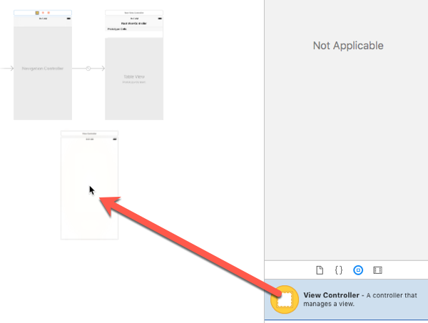

    1. Link the Login view to the controller module:
        1. Select the **View Controller Scene > View Controller** in the left-hand panel of the storyboard.
        1. In the **Utilities** panel, select the **Identity** inspector.
        1. Set the **Class** to **LoginViewController**.

            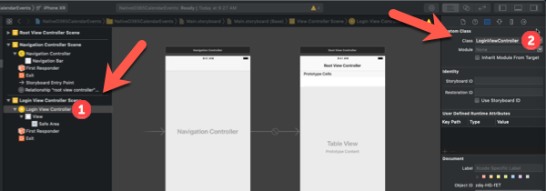

    1. Select and drag the **Text Field** onto the storyboard design surface.
        1. In the **Utilities** panel, select the **Attributes** inspector.
        1. Set the **Text** to **Office 365 Calendar Events**.

        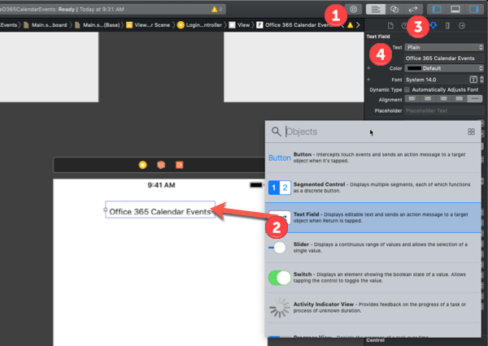

    1. Add a signin button to the view:
        1. Select and drag the **Button** onto the storyboard design surface.
        1. In the **Utilities** panel, select the **Attributes** inspector.
        1. Set the button's text to **Signin to Microsoft**.

            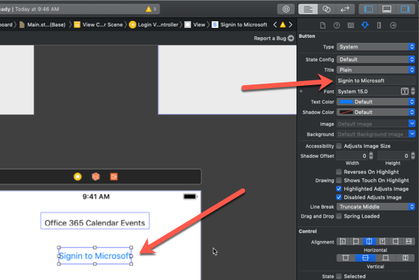

        1. With the button selected in the storyboard, in **Utilities** panel, select the **Connections** inspector.
        1. Select the circle plus icon in the **Referencing Outlets > New Referencing Outlet** option and drag it onto the surface of the login view in the storyboard:

            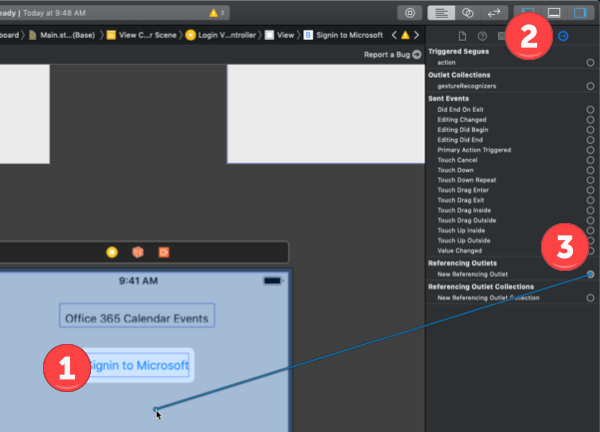

        1. In the box that appears, select **loginButton** to wire the button to the object defined in the **LoginViewController.h** interface file.
        1. Select the circle plus icon in the **Sent Events > Touch Up Inside** option, drag it onto the surface of the login view in the storyboard and select **loginAction**.

            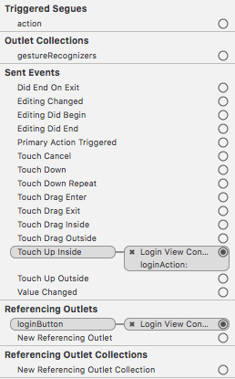

    1. Add a signout button to the view:
        1. Select and drag the **Button** onto the storyboard design surface.
        1. In the **Utilities** panel, select the **Attributes** inspector.
        1. Set the button's text to **Signout from Microsoft**.
        1. Unselect the **Control > State > Enabled** checkbox.
        1. With the button selected in the storyboard, in **Utilities** panel, select the **Connections** inspector.
        1. Select the circle plus icon in the **Referencing Outlets > New Referencing Outlet** option and drag it onto the surface of the login view in the storyboard:
        1. In the box that appears, select **logoutButton** to wire the button to the object defined in the **LoginViewController.h** interface file.
        1. Select the circle plus icon in the **Sent Events > Touch Up Inside** option, drag it onto the surface of the login view in the storyboard and select **logoutAction**.
    1. Select and drag the **Activity Indicator View** onto the storyboard design surface.
        1. Select the circle plus icon in the **Referencing Outlets > New Referencing Outlet** option, drag it onto the surface of the login view in the storyboard and select **activityIndicator**.

1. Change the storyboard flow so that the login view is displayed when the application loads:
    1. In the **Navigator** panel, select **Main.storyboard**.
    1. Select the **Navigation Controller Scene > Navigation Controller** on the left side of the storyboard.
    1. Press <kbd>control</kbd> and drag it onto the **Login View Controller** on the storyboard design surface.

        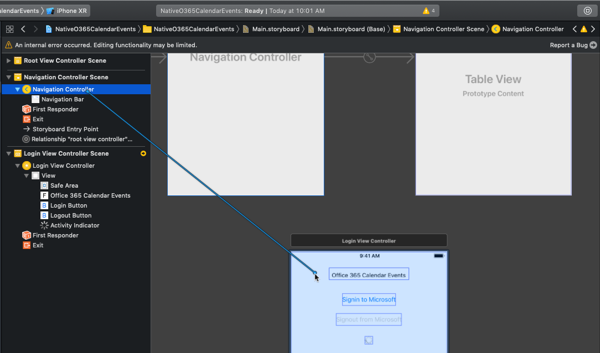

    1. In the dialog that appears, select **Relationship Segue > root view controller**.

        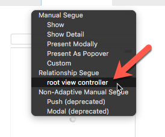

    1. The storyboard should now display a different flow of view logic so that:
        * the application will first load from the Navigation Controller
        * the Navigation Controller will then load the Login View Controller
        * the Root View Controller is now orphaned... this will be addressed later in the lab.

        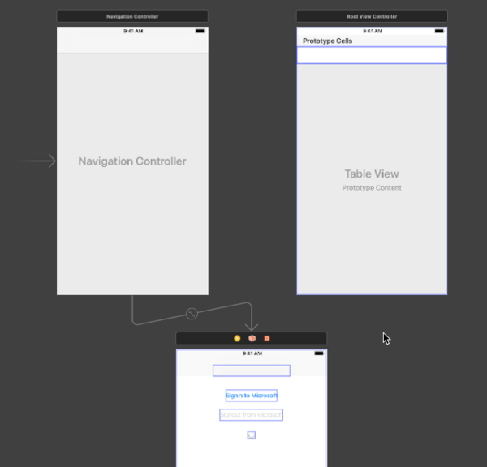

1. Test the user interface:
    1. Select the play button in the toolbar to build & run the application in the iPhone simulator.

        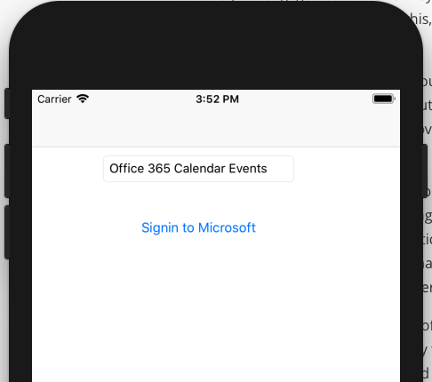

    1. When the application loads, select the **Signin to Microsoft** button.

        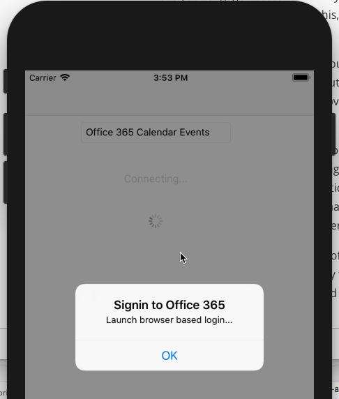

At this point you can stop the application in XCode. The user interface is mostly configured.
