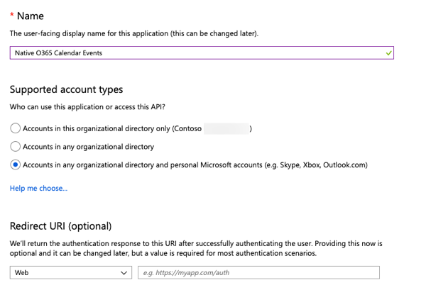
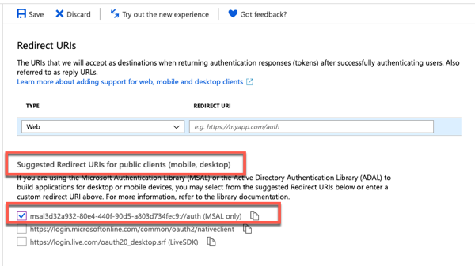
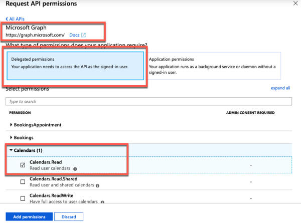
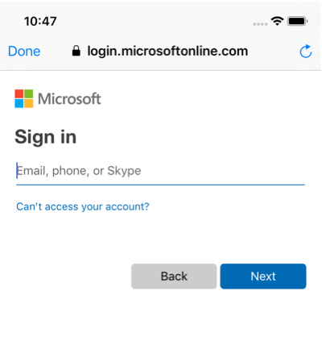
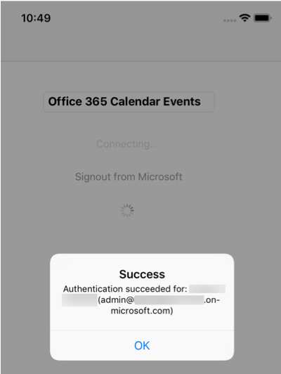
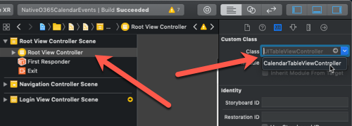
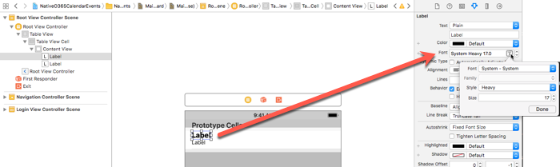
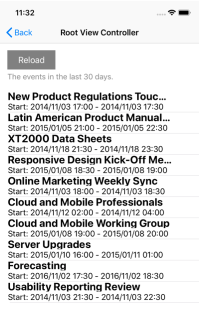

# Build iOS native apps with the Microsoft Graph REST API

In this lab you will create an Android application using the Azure AD v2 authentication endpoint and the Microsoft Authentication Library (MSAL) to access data in Office 365 using the Microsoft Graph REST API.

## In this lab

- [Create an Azure AD native application with the App Registration Portal](#exercise1)
- [Create an iOS native application](#exercise2)
- [Extend the iOS App for Azure AD Authentication](#exercise3)
- [Integrate Microsoft Graph into the Application](#exercise4)

## Prerequisites

To complete this lab, you need the following:

- Office 365 tenancy
  - If you do not have one, you obtain one (for free) by signing up to the [Office 365 Developer Program](https://developer.microsoft.com/en-us/office/dev-program).
- Desktop / laptop running MacOS
- [XCode v10.2.1](https://developer.apple.com/xcode/)
- [CocoaPods v1.7.1](https://cocoapods.org/)

<a name="exercise1"></a>

## Exercise 1: Create an Azure AD native application with the App Registration Portal

In this exercise you will create a new Azure AD native application using the Azure Active Directory admin center.

1. Open a browser and navigate to the [Azure Active Directory admin center (https://aad.portal.azure.com)](https://aad.portal.azure.com) and login using a **personal account** (aka: Microsoft Account) or **Work or School Account**.

1. Select **Azure Active Directory** in the left-hand navigation, then select **App registrations** under **Manage**.

    

1. Select **New registration**. On the **Register an application** page, set the values as follows.
    - Set **Name** to `Native O365 Calendar Events`.
    - Set **Supported account types** to **Accounts in any organizational directory and personal Microsoft accounts**.
    - Leave **Redirect URI** empty.

    

1. Choose **Register**.
1. On the **Android Graph Tutorial** page, copy the value of the **Application (client) ID** and save it, you will need it in the next step.

    

1. Select the **Add a Redirect URI** link.
1. On the **Redirect URIs** page, locate the **Suggested Redirect URIs for public clients (mobile, desktop)** section.
1. Select the URI that begins with `msal` and copy it, then choose **Save**. Save the copied redirect URI, you will need it in the next step.

    

1. Select **Manage > API Permissions**.

    Select **Add a permission** and select **Microsoft Graph**.

    

    Select **Delegated Permissions**, expand the **Calendar** group and select **Calendars.Read** scope.

    

    Select **Add permissions** to save your changes.

<a name="exercise2"></a>

## Exercise 2: Create an iOS native application
 
In this exercise you will create an iOS application and wire up the different screens.

1. Open XCode.
1. Select **File > New > Project**.
    1. In the **Choose a template for your new project**, select **Page-Based App**.

        

    1. Select **Next**.
    1. In the **Choose options for your new project**, enter the following values:
        - **Product Name**: NativeO365CalendarEvents
        - **Organization Name**: Microsoft
        - **Organization Identifier**: com.microsoft.officedev
        - **Language**: Objective-C
        - Unselect additional options

        

    1. Select **Next**.
    1. When prompted, select a location where to create the project on your workstation.
1. Cleanup the default storyboard
    1. In the **Navigator** panel, select the following files and delete them:
        - RootViewController.h
        - RootViewController.m
        - DataViewController.h
        - DataViewController.m
        - ModelController.h
        - ModelController.m
    1. In the **Project Manager** panel, select **Main.storyboard**:

        

    1. Select all the items in the storyboard by selecting any of the elements in the design surface and press <kbd>delete</kbd>.
1. Create the application's UI in the storyboard:
    1. In the **Navigator** panel, select **Main.storyboard**.
    1. In the **Utilities** panel, select the **Library** button in the toolbar (*#1 in the figure below*) to open the **Object Library**.
    1. Select and drag the **Navigation Controller** onto the storyboard design surface:

        

    1. Set the Navigation Controller as the initial view for the application:
        1. In the storyboard designer, select the **Navigation Controller**.
        1. In the **Utilities** panel, select the **Attributes Inspector**.
        1. Select the **Is Initial View Controller** option. Notice a faded right arrow is added to the storyboard, pointing to the Navigation Controller:

            

1. Create the a view controller that will be used by a new view you will create:
    1. Create a login view controller:
        1. Select **File > New File**.
        1. Select **Cocoa Touch Class** & select **Next**.
        1. In the **Choose options for your new file** dialog, set the following values, creating the file in the project root folder (the same folder where **AppDelegate.h** is located):
            - **Class**: LoginViewController
            - **Subclass of**: UIViewController
            - **Also create XIB file**: unselected
            - **Language**: Objective-C
        1. Open the **LoginViewController.h** file and add the following properties to the interface `LoginViewController`:

            ```objc
            @property (weak, nonatomic) IBOutlet UIButton *loginButton;
            @property (weak, nonatomic) IBOutlet UIButton *logoutButton;
            @property (weak, nonatomic) IBOutlet UIActivityIndicatorView *activityIndicator;
            ```

        1. Open the **LoginViewController.m** file and replace the contents of the `LoginViewController` class with the following code:

            ```objc
            - (void)viewDidLoad {
                [super viewDidLoad];
                self.activityIndicator.hidden = YES;
            }

            - (void)showMessage:(NSString*)message withTitle:(NSString *)title {
                UIAlertController * alert=   [UIAlertController
                                              alertControllerWithTitle:title
                                              message:message
                                              preferredStyle:UIAlertControllerStyleAlert];
                UIAlertAction* yesButton = [UIAlertAction
                                            actionWithTitle:@"OK"
                                            style:UIAlertActionStyleDefault
                                            handler:^(UIAlertAction * action)
                                            {
                                                [alert dismissViewControllerAnimated:YES completion:nil];
                                                [self showLoadingUI:NO];
                                            }];
                [alert addAction:yesButton];
                [self presentViewController:alert animated:YES completion:nil];
            }

            - (void)showLoadingUI:(BOOL)loading {
                if(loading){
                    self.activityIndicator.hidden = NO;
                    [self.activityIndicator startAnimating];
                    [self.loginButton setTitle:@"Connecting..." forState:UIControlStateNormal];
                    self.loginButton.enabled = NO;
                }
                else{
                    [self.activityIndicator stopAnimating];
                    [self.loginButton setTitle:@"Signin to Microsoft" forState:UIControlStateNormal];
                    self.loginButton.enabled = YES;
                    self.activityIndicator.hidden = YES;
                }
            }

            - (IBAction)loginAction:(id)sender{
                [self showLoadingUI:YES];
                [self showMessage:@"Launch browser based login..." withTitle:@"Signin to Microsoft"];

                self.loginButton.enabled = NO;
                self.logoutButton.enabled = YES;
            }

            - (IBAction)logoutAction:(id)sender{
                [self showLoadingUI:YES];
                [self showMessage:@"Signing out of Microsoft..." withTitle:@"Signout from Microsoft"];

                self.loginButton.enabled = YES;
                self.logoutButton.enabled = NO;
            }
            ```

1. Create the initial login screen that will be displayed when the application loads, prompting the user to signin to Office 365:
    1. In the **Navigator** panel, select **Main.storyboard**.
    1. Select the **Library** button in the toolbar to open the **Object Library**.
    1. Select and drag the **View Controller** onto the storyboard design surface:

        

    1. Link the Login view to the controller module:
        1. Select the **View Controller Scene > View Controller** in the left-hand panel of the storyboard.
        1. In the **Utilities** panel, select the **Identity** inspector.
        1. Set the **Class** to **LoginViewController**.

            

    1. Select and drag the **Text Field** onto the storyboard design surface.
        1. In the **Utilities** panel, select the **Attributes** inspector.
        1. Set the **Text Field** to **Office 365 Calendar Events**.

            

    1. Add a signin button to the view:
        1. Select and drag the **Button** onto the storyboard design surface.
        1. In the **Utilities** panel, select the **Attributes** inspector.
        1. Set the button's **Title** to **Signin to Microsoft**.

            

        1. With the button selected in the storyboard, in **Utilities** panel, select the **Connections** inspector.
        1. Select the circle plus icon in the **Referencing Outlets > New Referencing Outlet** option and drag it onto the surface of the login view in the storyboard:

            

        1. In the box that appears, select **loginButton** to wire the button to the object defined in the **LoginViewController.h** interface file.
        1. Select the circle plus icon in the **Sent Events > Touch Up Inside** option, drag it onto the surface of the login view in the storyboard and select **loginAction**.

            

    1. Add a signout button to the view:
        1. Select and drag the **Button** onto the storyboard design surface.
        1. In the **Utilities** panel, select the **Attributes** inspector.
        1. Set the button's **Title** to **Signout from Microsoft**.
        1. Unselect the **Control > State > Enabled** checkbox.
        1. With the button selected in the storyboard, in **Utilities** panel, select the **Connections** inspector.
        1. Select the circle plus icon in the **Referencing Outlets > New Referencing Outlet** option and drag it onto the surface of the login view in the storyboard:
        1. In the box that appears, select **logoutButton** to wire the button to the object defined in the **LoginViewController.h** interface file.
        1. Select the circle plus icon in the **Sent Events > Touch Up Inside** option, drag it onto the surface of the login view in the storyboard and select **logoutAction**.
    1. Select and drag the **Activity Indicator View** onto the storyboard design surface.
        1. Select the circle plus icon in the **Referencing Outlets > New Referencing Outlet** option, drag it onto the surface of the login view in the storyboard and select **activityIndicator**.

1. Change the storyboard flow so that the login view is displayed when the application loads:
    1. In the **Navigator** panel, select **Main.storyboard**.
    1. Select the **Navigation Controller Scene > Navigation Controller** on the left side of the storyboard.
    1. Press <kbd>control</kbd> and drag it onto the **Login View Controller** on the storyboard design surface.

        

    1. In the dialog that appears, select **Relationship Segue > root view controller**.

        

    1. The storyboard should now display a different flow of view logic so that:
        - the application will first load from the Navigation Controller
        - the Navigation Controller will then load the Login View Controller
        - the Root View Controller is now orphaned... this will be addressed later in the lab.

        

1. Test the user interface:
    1. Select the play button in the toolbar to build & run the application in the iPhone simulator.

        

    1. When the application loads, select the **Signin to Microsoft** button.

        

At this point you can stop the application in XCode. The user interface is mostly configured.

<a name="exercise3"></a>

## Exercise 3: Extend the iOS App for Azure AD Authentication

With the application created, now extend it to support authentication with Azure AD. This is required to obtain the necessary OAuth access token to call the Microsoft Graph. In this exercise you will integrate the Microsoft Authentication Library (MSAL) into the application.

1. If the XCode application is open from a previous session, close it.
1. Add the MSAL iOS SDK via CocoaPods:
    1. From a command prompt, go to the root folder for the project:
    1. Execute `pod init` to initialize CocoaPoads and create a **podfile**.
    1. Open the **Podfile** created in the root of the project folder.
    1. Add the line `pod 'MSAL'` immediately before the closing `end`. The contents of the file should look similar to the following:

        ```txt
        # Uncomment the next line to define a global platform for your project
        # platform :ios, '9.0'

        target 'NativeO365CalendarEvents' do
          # Uncomment the next line if you're using Swift or would like to use dynamic frameworks
          # use_frameworks!

          # Pods for NativeO365CalendarEvents

          pod 'MSAL'

        end
        ```

    1. From the command prompt, execute `pod install` to install the MSAL iOS SDK via Cocoapods.
1. Open the project workspace in XCode:
    1. In XCode, select **File > Open**.
    1. Select the workspace file **NativeO365CalendarEvents.xcworkspace** and select **Open**.
1. Update the application's configuration to include the Azure AD application's ID:
    1. In the **Navigator**, right-click the **Info.plist** file and select **Open As > Source Code**.
    1. Add the following XML immediately before the closing `</dict>` element:

        ```xml
        <key>CFBundleURLTypes</key>
        <array>
            <dict>
                <key>CFBundleTypeRole</key>
                <string>Editor</string>
                <key>CFBundleURLName</key>
                <string>$(PRODUCT_BUNDLE_IDENTIFIER)</string>
                <key>CFBundleURLSchemes</key>
                <array>
                    <string>msalENTER_YOUR_CLIENT_ID</string>
                    <string>auth</string>
                </array>
            </dict>
        </array>
        ```

    1. In the previous XML, replace the `ENTER_YOUR_CLIENT_ID` with the Azure AD application's ID you copied from a previous step.

        >Note: Be sure to leave the `msal` as the prefix before the Azure AD application's ID so it looks similar to this: `<string>msale1d082fe-32d3-4adb-a0ec-3a2183f4866d</string>`

1. Update the application to handle a response from the MSAL library:
    1. In the **Navigator**, select the **AppDelegate.m** file.
    1. Add the following `import` statement after the existing ones:

        ```objc
        #import <MSAL/MSAL.h>
        ```

    1. Add the following method to the end of the file, before the closing `@end` statement.

        ```objc
        - (BOOL)application:(UIApplication *)app openURL:(NSURL *)url options:(NSDictionary<NSString *,id> *)options
        {
          [MSALPublicClientApplication handleMSALResponse:url];
          return YES;
        }
        ```

1. Create a new authentication manager class:
    1. Select **File > New File**.
        1. Select **Cocoa Touch Class** and select **Next**.
        1. In the **Choose options for your new file** dialog, set the following values, select **Next** and then select **Create**:
            - **Class**: AuthenticationManager
            - **Subclass of**: NSObject
            - **Language**: Objective-C

1. Code the `AuthenticationManager` interface:
    1. Open the **AuthenticationManager.h** file.
    1. Add the following `import` statement after the existing ones:

        ```objc
        #import <MSAL/MSAL.h>
        ```

    1. Add the following code to the body of the `AuthenticationManager` interface:

        ```objc
        // implement singleton pattern as a shared instance
        +(AuthenticationManager*)sharedInstance;

        // public members
        @property (nonatomic, strong) NSString *accessToken;
        @property (nonatomic, strong) NSString *userID;
        @property (nonatomic, strong) MSALPublicClientApplication *msalClient;
        @property (nonatomic, weak) NSString *clientId;
        @property (nonatomic, weak) NSString *authorty;
        @property (nonatomic, strong) MSALUser *user;

        // public methods
        - (void)initWithAuthority:(NSString*)authority
                      completion:(void (^)(NSError *error))completion;

        - (void)acquireAuthTokenWithScopes:(NSArray<NSString *> *)scopes completion:(void(^)(MSALErrorCode error))completion;

        - (void)acquireAuthTokenCompletion:(void (^)(MSALErrorCode *error))completion;

        - (void)clearCredentials;

        - (NSString *)getRedirectUrlFromMSALArray:(NSArray *) array;
        ```

1. Code the implementation of the `AuthenticationManager` class:
    1. Open the **AuthenticationManager.m** file.
    1. Add the following `import` statement after the existing ones:

        ```objc
        #import <MSAL/MSAL.h>
        ```

    1. Add the following code to the `AuthenticationManager` to create an implement the class constructor:

        ```objc
        #pragma mark - init
        - (void)initWithAuthority:(NSString*)authority_
                    completion:(void (^)(NSError* error))completion
        {
            //Get the MSAL client Id for this Azure app registration. We store it in the main bundle
            NSDictionary *dictionary = [NSDictionary dictionaryWithContentsOfFile:[[NSBundle mainBundle] pathForResource:@"Info" ofType:@"plist"]];
            NSArray *array = [dictionary objectForKey:@"CFBundleURLTypes"];
            NSString *redirectUrl = [self getRedirectUrlFromMSALArray:(array)];

            NSRange range = [redirectUrl rangeOfString:@"msal"];
            NSString *kClientId = [[redirectUrl substringFromIndex:NSMaxRange(range)] stringByTrimmingCharactersInSet:[NSCharacterSet whitespaceCharacterSet]];
            NSLog(@"client id = %@", kClientId);

            self.clientId = kClientId;
            self.authorty = authority_;

            NSError *error_ = nil;
            @try {
                self.msalClient = [[MSALPublicClientApplication alloc] initWithClientId:kClientId error:&error_];
                if (error_) {
                    completion(error_);
                } else {
                    completion(nil);}
            }
            @catch(NSException *exception) {
                NSMutableDictionary * info = [NSMutableDictionary dictionary];
                [info setValue:exception.name forKey:@"ExceptionName"];
                [info setValue:exception.reason forKey:@"ExceptionReason"];
                [info setValue:exception.callStackReturnAddresses forKey:@"ExceptionCallStackReturnAddresses"];
                [info setValue:exception.callStackSymbols forKey:@"ExceptionCallStackSymbols"];
                [info setValue:exception.userInfo forKey:@"ExceptionUserInfo"];

                NSError *error = [[NSError alloc] initWithDomain:MSALErrorDomain code:MSALErrorInternal userInfo:info];
                //use error
                completion(error);
            }
        }
        ```

    1. Add the following code to the `AuthenticationManager` class to implement a single static instance of the class:

        ```objc
        #pragma mark - singleton
        + (AuthenticationManager *)sharedInstance
        {
            static AuthenticationManager *sharedInstance;
            static dispatch_once_t onceToken;

            // Initialize the AuthenticationManager only once.
            dispatch_once(&onceToken, ^{
                sharedInstance = [[AuthenticationManager alloc] init];
            });

            return sharedInstance;
        }
        ```

    1. Add the following code to the `AuthenticationManager` class to implement the `acquireAuthTOkenWithScopes()` method:

        ```objc
        #pragma mark - acquire token
        - (void)acquireAuthTokenWithScopes:(NSArray<NSString *> *)scopes
                                completion:(void(^)(MSALErrorCode error))completion {

            NSError  __autoreleasing  *error_ = nil;
            NSArray<MSALUser *> *users = [self.msalClient users:(&error_)];

            if (self.msalClient == nil) {
                completion(MSALErrorInternal);
            }

            if (users == nil | [users count] == 0) {
                @try {
                    [self.msalClient acquireTokenForScopes:scopes completionBlock:^(MSALResult *result, NSError *error) {
                        if (error) {
                            completion(error.code);
                        } else {
                            self.clientId = self.msalClient.clientId;
                            self.accessToken = result.accessToken;

                            self.user = result.user;
                            self.userID = result.user.displayableId;
                            completion(0);

                        }
                    }];
                }
                @catch (NSException *exception) {
                    completion(MSALErrorInternal);
                }
            } else {
                @try {
                    self.user =  [users objectAtIndex:0];
                    [self.msalClient acquireTokenSilentForScopes:scopes user:self.user completionBlock:^(MSALResult *result, NSError *error) {
                        if (error) {
                            completion(MSALErrorInteractionRequired);
                        } else {
                            self.clientId = self.msalClient.clientId;
                            self.accessToken = result.accessToken;
                            self.userID = result.user.displayableId;

                            completion(0);
                        }
                    }];
                }
                @catch (NSException *exception) {
                    completion(MSALErrorInternal);
                }
            }
        }
        ```

    1. Add the following code to the `AuthenticationManager` class to implement the `acquireAuthTokenCompletion()` method:

        ```objc
        -(void) acquireAuthTokenCompletion:(void (^)(MSALErrorCode *error))completion{
        }

        #pragma mark - Get client id from bundle

        - (NSString *) getRedirectUrlFromMSALArray:(NSArray *) array {
            NSDictionary *arrayElement = [array objectAtIndex: 0];
            NSArray *redirectArray = [arrayElement valueForKeyPath:@"CFBundleURLSchemes"];
            NSString *substring = [redirectArray objectAtIndex:0];
            return substring;
        }
        ```

    1. Add the following code to the `AuthenticationManager` class to implement the `clearCredentials()` method:

        ```obj
        #pragma mark - clear credentials
        - (void)clearCredentials {
            NSError *error_ = nil;
            [self.msalClient removeUser:self.user error:&error_];
        }
        ```

1. Update the login controller to wire up the authentication manager:
    1. Open the **LoginViewController.m** file.
    1. Add the following `import` statements after the existing ones:

        ```objc
        #import "AuthenticationManager.h"
        #import <MSAL/MSALUser.h>
        ```

    1. Add the following code after the `import` statements to declare a constant string for the root part of the Azure AD OAuth v2 endpoints:

        ```objc
        NSString * const kAuthority   = @"https://login.microsoftonline.com/common/v2.0";
        ```

    1. Add the following code to the existing `LoginViewController` interface:

        ```objc
        @property (weak, nonatomic) NSArray *scopes;
        ```

    1. Replace the contents of the `loginAction()` method with the following code to the existing `LoginViewController` class:

        ```objc
        [self showLoadingUI:YES];

        self.scopes = [NSArray arrayWithObjects:@"https://graph.microsoft.com/User.Read", @"https://graph.microsoft.com/Calendars.Read", nil];

        AuthenticationManager *authenticationManager = [AuthenticationManager sharedInstance];
        [authenticationManager initWithAuthority:kAuthority completion:^(NSError *error) {
            if (error) {
                [self showLoadingUI:NO];
                [self showMessage:@"Please see the log for more details" withTitle:@"InitWithAuthority Error"];
            } else {
                [authenticationManager acquireAuthTokenWithScopes:self.scopes completion:^(MSALErrorCode error) {
                    if(error){
                        [self showLoadingUI:NO];
                        [self showMessage:@"Please see the log for more details" withTitle:@"AcquireAuthToken Error"];

                        self.loginButton.enabled = YES;
                        self.logoutButton.enabled = NO;
                    } else {
                        dispatch_async(dispatch_get_main_queue(), ^{
                            MSALUser *currentUser = [authenticationManager user];

                            NSString *successMessage = @"Authentication succeeded for: ";
                            successMessage = [successMessage stringByAppendingString:[currentUser name]];
                            successMessage = [successMessage stringByAppendingString:@" ("];
                            successMessage = [successMessage stringByAppendingString:[currentUser displayableId]];
                            successMessage = [successMessage stringByAppendingString:@")"];

                            [self showMessage:successMessage withTitle:@"Success"];

                            self.loginButton.enabled = NO;
                            self.logoutButton.enabled = YES;
                        });
                    }
                }];
            }
        }];
        ```

    1. Replace the contents of the `logoutAction()` method with the following code to the existing `LoginViewController` class:

        ```objc
        [self showLoadingUI:YES];
        [self showMessage:@"Signing out of Microsoft..." withTitle:@"Signout from Microsoft"];

        AuthenticationManager *authenticationManager = [AuthenticationManager sharedInstance];
        [authenticationManager clearCredentials];

        self.loginButton.enabled = YES;
        self.logoutButton.enabled = NO;
        ```

1. Test the user interface:
    1. Select the play button in the toolbar to build & run the application in the iPhone simulator.
    1. When the application loads in the simulator, select **Signin with Microsoft**.
    1. When prompted, signin using your Office 365 account:

        

    1. After a successful signin, you should see an alert box appear with your name.

        

    1. Test the signout process by selecting the **Signout with Microsoft**.

<a name="exercise4"></a>

## Exercise 4: Integrate Microsoft Graph into the Application

The last exercise is to incorporate the Microsoft Graph into the application. For this application, you will use the Microsoft Graph REST API.

1. Create a new controller for the calendar view:
    1. Select **File > New File**.
        1. Select **Cocoa Touch Class** and select **Next**.
        1. In the **Choose options for your new file** dialog, set the following values, select **Next** and then select **Create**:
            - **Class**: CalendarTableViewController
            - **Subclass of**: UITableViewController
            - **Also create XIB file**: unselected
            - **Language**: Objective-C
    1. Open the **CalendarTableViewController.h** file.
        1. Add the following code to the `CalendarTableViewController` interface:

            ```objc
            @property (strong, nonatomic) NSMutableArray* eventsList;
            ```

1. Associate the calendar events view with it's new controller:
    1. In the **Navigator** panel, select **Main.storyboard**.
    1. In the storyboard designer, select the **Root View Controller Scene > Root View Controller**
        1. In the **Utilities** panel, within the **Identity** inspector, set the **Class** to **CalendarTableViewController**.

            

        1. In the **Utilities** panel, within the **Identity** inspector:
            - Set the **Identity > Storyboard ID** to **calendarList**.
            - Set the **Document > Label** to **CalendarList**.
    1. In the storyboard designer, select the **CalendarList Scene > CalendarList > Table View > Table View Cell**.
        1. In the **Utilities** panel, within the **Identity** inspector, set the **Document > Label** to **calendarListCell**.
        1. In the **Utilities** panel, within the **Attributes** inspector, set the **Table View Cell > Identifier** to **eventCellTableViewCell**.

1. Implement the user interface for the table cells that will display events.
    1. In the **Utilities** panel, drag two **Label** controls from the **Object** library into the white box for the table view cell.
        - Place the two tables vertically and left-aligned.
        - Stretch the width of the labels to go to the right edge of the screen to avoid wrapping.
    1. In the **Utilities** panel, within the **Attributes** inspector, modify the formatting of the two labels as you would like them to appear

        

    1. In the **Utilities** panel, within the **Identity** inspector, set the **Document > Label** for the two labels to the following values:
        - subjectLabel
        - dateLabel
    1. In the **Utilities** panel, within the **Attributes** inspector, set the select each of the two labels and set the following properties:
        - subjectLabel
            - **Label > Label**: subjectLabel
            - **View > Tag**: 100
        - dateLabel
            - **Label > Label**: dateLabel
            - **View > Tag**: 200

    1. Open the **CalendarTableViewController.m** file.
    1. Add the following `import` statement after the existing ones:

        ```objc
        #import "AuthenticationManager.h"
        #import <MSAL/MSAL.h>
        ```

1. Implement the calendar view's controller:
    1. Open the **CalendarTableViewController.m** file.
    1. Add the following method to the `CalendarTableViewController` class:

        ```objc
        -(void)getEvents
        {
            // authProvider
            AuthenticationManager *authManager = [AuthenticationManager sharedInstance];

            UIActivityIndicatorView* spinner = [[UIActivityIndicatorView alloc]initWithFrame:CGRectMake(100,100,50,50)];
            spinner.activityIndicatorViewStyle = UIActivityIndicatorViewStyleWhiteLarge;
            [spinner setColor:[UIColor blackColor]];
            [self.view addSubview:spinner];
            spinner.hidesWhenStopped = YES;
            [spinner startAnimating];

            NSString *dataUrl = @"https://graph.microsoft.com/v1.0/me/events?$select=subject,start,end";
            NSURL *url = [NSURL URLWithString:dataUrl];
            NSURLSessionConfiguration *config = [NSURLSessionConfiguration defaultSessionConfiguration];
            NSURLSession *session = [NSURLSession sessionWithConfiguration:config];

            NSMutableURLRequest *request = [[NSMutableURLRequest alloc] initWithURL:url];
            request.HTTPMethod = @"GET";

            [request setValue:@"application/json" forHTTPHeaderField:@"Content-Type"];
            [request setValue:@"application/json, text/plain, */*" forHTTPHeaderField:@"Accept"];

            NSString *authorization = [NSString stringWithFormat:@"Bearer %@", authManager.accessToken];
            [request setValue:authorization forHTTPHeaderField:@"Authorization"];

            __weak CalendarTableViewController *weakSelf = self;
            NSURLSessionDataTask *task = [session dataTaskWithRequest:request
                                                    completionHandler:^(NSData *data, NSURLResponse *response, NSError *error) {
                                                        // ...
                                                        CalendarTableViewController *strongSelf = weakSelf;
                                                        NSError *jsonError = nil;

                                                        NSDictionary *jsonFinal = [NSJSONSerialization JSONObjectWithData:data options:0 error:&jsonError];
                                                        if (jsonError)
                                                        {
                                                            NSLog(@"Error: %@", jsonError);
                                                        }
                                                        self.eventsList = [jsonFinal valueForKey:@"value"];
                                                        dispatch_async(dispatch_get_main_queue(), ^{
                                                            [spinner stopAnimating];
                                                            [spinner removeFromSuperview];
                                                            [strongSelf.tableView reloadData];
                                                        });
                                                    }];

            [task resume];
        }
        ```

    1. Add the following code to the `viewDidLoad()` method:

        ```objc
        self.eventsList = [[NSMutableArray alloc] init];
        [self getEvents];
        ```

    1. Add the following three utility methods to the `CalendarTableViewController` class:

        ```objc
        - (UIImage *)imageWithColor:(UIColor *)color {
            CGRect rect = CGRectMake(0.0f, 0.0f, 1.0f, 1.0f);
            UIGraphicsBeginImageContext(rect.size);
            CGContextRef context = UIGraphicsGetCurrentContext();

            CGContextSetFillColorWithColor(context, [color CGColor]);
            CGContextFillRect(context, rect);

            UIImage *image = UIGraphicsGetImageFromCurrentImageContext();
            UIGraphicsEndImageContext();

            return image;
        }
        -(NSString *)converStringToDateString:(NSString *)stringDate {
            NSString *result = @"";

            NSDateFormatter *retdateFormat = [[NSDateFormatter alloc] init];
            [retdateFormat setDateFormat:@"yyyy'/'MM'/'dd HH':'mm"];

            NSDateFormatter *formatter = [[NSDateFormatter alloc] init];
            [formatter setDateFormat:@"yyyy-MM-dd'T'HH:mm:ss.SSSSSSS"];
            NSDate *convertData =[formatter dateFromString:stringDate];

            result = [retdateFormat stringFromDate:convertData];

            return result;
        }

        - (UIView *)tableView:(UITableView *)tableView viewForHeaderInSection:(NSInteger)section{
            UIView *view = [[UIView alloc] initWithFrame:CGRectMake(0, 20, 300, 200)];

            UIButton* actionButton = [UIButton buttonWithType:UIButtonTypeCustom];
            [actionButton setFrame:CGRectMake(15, 15, 100, 40)];
            [actionButton setBackgroundImage:[self imageWithColor:[UIColor grayColor]] forState:UIControlStateNormal];
            [actionButton setTitle:@"Reload" forState:UIControlStateNormal];
            [actionButton addTarget:self action:@selector(getEvents) forControlEvents:UIControlEventTouchUpInside];
            [view addSubview:actionButton];

            NSString *lbl1str = @"The events in the last 30 days.";
            UILabel *lbl1 = [[UILabel alloc] initWithFrame:CGRectMake(15, 55, 280, 30)];
            lbl1.text = lbl1str;
            lbl1.textAlignment = NSTextAlignmentLeft;
            lbl1.font = [UIFont systemFontOfSize:16];
            lbl1.textColor = [UIColor colorWithRed:136.00f/255.00f green:136.00f/255.00f blue:136.00f/255.00f alpha:1];
            [view addSubview:lbl1];

            return view;
        }
        ```

    1. Locate the method `numberOfSectionsInTableView()` in the `CalendarTableViewController` class. Replace the contents of this method with the following code:

        ```objc
        return 1;
        ```

    1. Locate the method `numberOfRowsInSection()` in the `CalendarTableViewController` class. Replace the contents of this method with the following code:

        ```objc
        return [self.eventsList count];
        ```

    1. Add the following method to the `CalendarTableViewController` class:

        ```objc
        - (CGFloat)tableView:(UITableView *)tableView heightForHeaderInSection:(NSInteger)section
        {
            return 100;
        }
        ```

    1. Add the following method to the `CalendarTableViewController` class:

        ```objc
        - (UITableViewCell *)tableView:(UITableView *)tableView cellForRowAtIndexPath:(NSIndexPath *)indexPath {
            static NSString *CellIdentifier = @"eventCellTableViewCell";
            UITableViewCell *cell = [tableView dequeueReusableCellWithIdentifier:CellIdentifier];

            // Configure the cell...
            if (cell == nil) {
                cell = [[UITableViewCell alloc] initWithStyle:UITableViewCellStyleDefault reuseIdentifier:CellIdentifier];
            }
            UILabel *subjectLabel = (UILabel *)[cell viewWithTag:100];
            NSDictionary *calendarItem = [self.eventsList objectAtIndex:indexPath.row];
            subjectLabel.text = [calendarItem valueForKey:@"subject"]; // ((MSGraphEvent *)[self.eventsList objectAtIndex:indexPath.row]).subject;;

            NSString *startTime = (NSString *)[[calendarItem valueForKey:@"start"] valueForKey:@"dateTime"];
            NSString *endTime = (NSString *)[[calendarItem valueForKey:@"end"] valueForKey:@"dateTime"];

            NSString *startText = [NSString stringWithFormat:@"Start: %@",[self converStringToDateString:startTime]];
            NSString *endText = [NSString stringWithFormat:@"%@",[self converStringToDateString:endTime]];

            NSString *eventDatetime = startText;
            eventDatetime = [eventDatetime stringByAppendingString:@" - "];
            eventDatetime = [eventDatetime stringByAppendingString:endText];

            UILabel *dateLabel = (UILabel *)[cell viewWithTag:200];
            dateLabel.text = eventDatetime;

            return cell;
        }
        ```

1. Update the login controller so after a successful login, it will programmatically load the calendar event view:
    1. In the **Navigator**, select the **LoginViewController.m**
    1. Locate the `loginAction()` method in the `LoginViewController` class.
    1. Within the `loginAction()` method, locate the following `else` statement:

        ```objc
        ..
        } else {
            dispatch_async(dispatch_get_main_queue(), ^{
                [self showLoadingUI:NO];
                MSALUser *currentUser = [authenticationManager user];

                NSString *successMessage = @"Authentication succeeded for: ";
                successMessage = [successMessage stringByAppendingString:[currentUser name]];
                successMessage = [successMessage stringByAppendingString:@" ("];
                successMessage = [successMessage stringByAppendingString:[currentUser displayableId]];
                successMessage = [successMessage stringByAppendingString:@")"];

                [self showMessage:successMessage withTitle:@"Success"];
            });
        }
        ```

    1. Replace the body of the `dispatch_async()` method with code that will update the login view and navigate to the **calendarList** view:

        ```objc
        } else {
            dispatch_async(dispatch_get_main_queue(), ^{
                [self showLoadingUI:NO];
                self.loginButton.enabled = NO;
                self.logoutButton.enabled = YES;

                UIStoryboard *board = [UIStoryboard storyboardWithName:@"Main" bundle:NSBundle.mainBundle];
                UIViewController *calVC = [board instantiateViewControllerWithIdentifier:@"calendarList"];
                [self.navigationController pushViewController:calVC animated:YES];
            });
        }
        ```

1. Test the user interface:
    1. Select the play button in the toolbar to build & run the application in the iPhone simulator.
    1. When the application loads in the simulator, select **Signin with Microsoft**.
    1. When prompted, signin using your Office 365 account:
    1. After a successful signin, the app will navigate to the view that displays events from your calendar:

        

    1. Select the **Back** link at the top of the screen to go back to the login view where you can optionally signout.
